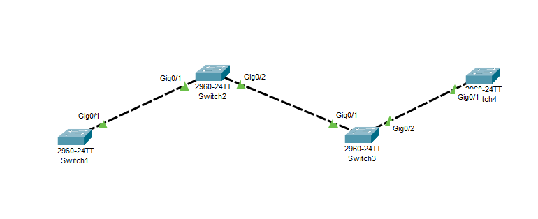

# Cisco CCNA Lab: Implementacija i Ponašanje VTP-a (VLAN Trunking Protocol)

Ovaj repozitorijum sadrži praktični lab rađen u programu **Cisco Packet Tracer** sa fokusom na konfiguraciju, verifikaciju i analizu ponašanja VTP protokola unutar linearne switch mreže.

---

## VTP



##  Topologija Mreže i Uloge Uređaja

Mreža se sastoji od 4 Cisco switcha povezanih u niz preko Gigabit Ethernet magistrala (**Trunk** linkovi):

`[SW1 (Server)] === (Trunk) === [SW2 (Client)] === (Trunk) === [SW3 (Transparent)] === (Trunk) === [SW4 (Server)]`

### Pregled VTP Modova i Konfiguracije po Uređajima

| Uređaj | VTP Mod | Funkcija i Ponašanje u Topologiji | CLI Konfiguracione Komande |
| :--- | :--- | :--- | :--- |
| **SW1** | **Server** (Primarni) | Glavna tačka upravljanja. Kreira i briše VLAN-ove, povećava broj revizije (*Revision*) i šalje oglase mrežom. | `vtp domain CCNA_LAB`<br>`vtp password cisco`<br>`vtp mode server` |
| **SW2** | **Client** | Prati vođu. Automatski prepisuje VLAN bazu koju mu šalje SW1. Ručno kreiranje VLAN-ova je zaključano. | `vtp domain CCNA_LAB`<br>`vtp password cisco`<br>`vtp mode client` |
| **SW3** | **Transparent** | Samotnjak i prosljeđivač. Ignoriše VTP poruke i ne mijenja svoju tabelu, ali prosljeđuje paket dalje prema SW4. | `vtp domain CCNA_LAB`<br>`vtp password cisco`<br>`vtp mode transparent` |
| **SW4** | **Server** (Sekundarni) | Nalazi se iza SW3. Prima proslijeđeni paket od SW1 i, pošto ima isti domen i lozinku, uspješno sinhronizuje bazu. | `vtp domain CCNA_LAB`<br>`vtp password cisco`<br>`vtp mode server` |

---

## Konfiguracioni Koraci (Cisco IOS)

### 1. Podizanje Trunk linkova na spojevima
Prije konfiguracije samog VTP-a, svi interfejsi koji povezuju switčeve moraju biti prebačeni u Trunk mod kako bi VTP paketi uopšte mogli da putuju između uređaja.

```text
! Primjer za SW2 koji koristi oba Gigabit porta za vezu sa SW1 i SW3
Switch2# configure terminal
Switch2(config)# interface range gigabitethernet 0/1 - 2
Switch2(config-if-range)# switchport mode trunk
